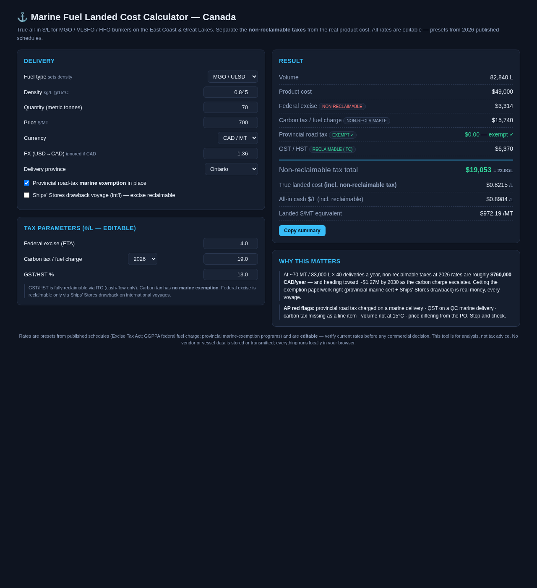

# ⚓ Marine Fuel Landed Cost Calculator (Canada)

Separate the **non-reclaimable taxes** from the real product cost on Canadian
marine fuel deliveries — East Coast and Great Lakes — and see the true all-in
price per litre before you negotiate.

A single-file HTML app: open `index.html` in any browser. No build step, no
server, no packages, no data leaves the machine. Everything runs locally.

## Why it exists

Canadian marine diesel carries four tax layers, and only some of them are a
real cost:

| Tax | 2026 rate | Real cost? |
|-----|-----------|-----------|
| Federal excise (Excise Tax Act) | 4.0¢/L | **Yes** — unless recovered via Ships' Stores drawback (international voyages, ETA s. 70) |
| Carbon tax / federal fuel charge (GGPPA) | ~19¢/L | **Yes** — no marine exemption; escalates to ~35¢+/L by 2030 |
| Provincial road tax | 8–19¢/L by province | **Avoidable** with a marine exemption certificate (ON bulk permit · QC FP-250.1-V · NB/NL marine cert · NS interprovincial) |
| GST/HST | 5–15% | Cash-flow only — fully reclaimable via ITC |

At 70 MT (~83,000 L) × 40 deliveries/year that is roughly **$760K CAD/year of
non-reclaimable tax at 2026 rates**, heading toward ~$1.27M by 2030. Exemption
paperwork is real money on every voyage.

## Use it

1. Pick fuel type, density, tonnes, price basis ($/MT, CAD or USD + FX)
2. Pick the delivery province — HST and the exemption program preset
3. Toggle your exemption status and Ships' Stores drawback voyage
4. All rates are **editable**; the carbon-charge selector presets the official
   2025→2030 schedule
5. Read the answer: litres, product cost, each tax line (reclaimable vs not),
   **true landed $/L** and all-in cash $/L

A **Copy summary** button produces a plain-text quote-ready summary.

## What it is not

Rates are presets from published schedules (ETA, GGPPA, provincial exemption
programs) and must be verified before commercial decisions. This is an
analysis tool, not tax advice — and it is deliberately built with **no vendor
prices, no vessel data, and no storage**: it is a calculator, not a database.

## Files

- `index.html` — the whole app (styles, logic, UI in one file)
- `screenshot.png` — preview

## License

MIT — see [LICENSE](LICENSE).
